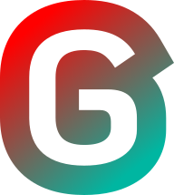

<div align="center">
  <picture>
    
  </picture>

[Website](https://george-language.github.io/) | [Download](https://george-language.github.io/install/) | [Learn](https://george-language.github.io/book/) | [Documentation](https://george-language.github.io/docs/)

_A dog-themed, interpreted programming language for beginners._
</div>

## Code in Action

```
# import the math module
fetch std_math;

obj x = 0;

# let's go for a walk!
walk i = 0 through 10 {
    x = x + 1;

    if x == 5 {
        leave;
    }
}

# print the value of 'x'
bark(x);

# greet someone
func greet(name) {
    bark("Hello, " + name + "!");
}

greet("John Doe");

bark("Pi is equal to: " + tostring(math_pi));
bark("We have reached the end of our program. I hope you enjoyed!");
```

## Why George Language?

It all started as a joke. One of our team members has a pug named George. He's adorable, stubborn, and full of personality. One day, someone asked:

_"What if we made a language named after George? Something cute, funny, but also powerful and easy to learn?"_

That idea stuck. And **George Language (GLang)** was born.

We made GLang because we believe beginner-friendly languages don’t have to be boring. GLang is:

- 🐕 **Approachable** — Simple syntax and fun naming conventions
- 🧠 **Educational** — Teaches real programming concepts under the hood
- 🎉 **Memorable** — Functions like `bark`, `chew`, and `uhoh` make coding more intuitive and playful

> Beginners don't say "print"; they say "make the computer bark!"

## Features

- 🐶 Whimsical, beginner-friendly syntax
- 📚 Built-in modules for math, strings, and more
- 💬 Easy-to-understand functions like `dig()`, `bury()`, and `uhoh()`
- 📦 Package management with `kennels` and extensible with `fetch`
- 🌐 Open source and growing community

## Installation

You can download GLang [here](https://george-language.github.io/docs/install/), or check out the quick setup instructions in the [guide book](https://george-language.github.io/book/).

## License

George Language is licensed under **GPL v3**.
That means it's **free, open source, and always will be** just like George's spirit.
